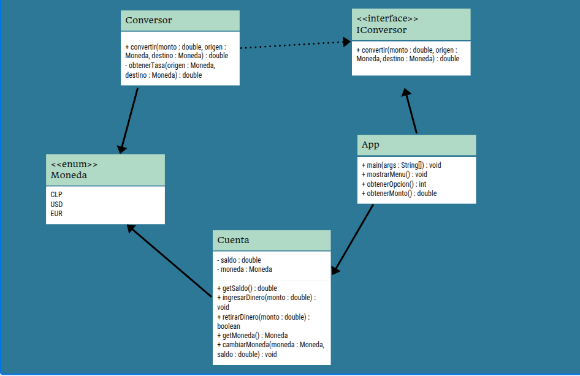

# AlkeWallet

AlkeWallet es una aplicación de consola desarrollada en Java que permite administrar una billetera digital simple.  
El sistema permite crear una cuenta, gestionar ingresos y retiros de dinero, consultar el saldo disponible y convertir montos entre distintas monedas.

Este proyecto fue desarrollado aplicando Programación Orientada a Objetos, uso de interfaces, pruebas unitarias y buenas prácticas de desarrollo backend.

---

##  Funcionalidades

- Creación de una cuenta con saldo inicial cero.
- Visualización del saldo disponible.
- Ingreso de dinero a la cuenta.
- Retiro de dinero con validación.
- Conversión de moneda entre:
  - CLP
  - USD
  - EUR
- Menú interactivo por consola.

---

##  Tecnologías utilizadas

- **Java 21**
- **Gradle**
- **JUnit 5** (JUnit Jupiter)
- **POO**
- **Diagramas UML**

---

## Arquitectura y diseño

El proyecto está organizado siguiendo principios de separación de responsabilidades:

### Clases principales

- **App**  
  Controla la ejecución del programa y la interacción con el usuario mediante la consola.

- **Cuenta**  
  Representa la cuenta bancaria. Gestiona el saldo, ingresos, retiros y la moneda asociada.

- **Conversor**  
  Implementa la lógica de conversión de monedas.

- **IConversor (Interface)**  
  Define el contrato para la conversión de monedas, permitiendo reutilización y desacoplamiento del código.

- **Moneda (Enum)**  
  Define los tipos de moneda disponibles en el sistema.

---

## Diagrama de Clases

El modelo del sistema fue representado mediante un **diagrama de clases UML**, donde se observa:

- Uso de una interfaz para la conversión de monedas.
- Relaciones entre las clases principales.
- Uso de un `enum` para representar las monedas.




## Pruebas unitarias

Se implementaron pruebas unitarias utilizando **JUnit 5**, cubriendo los siguientes casos:

- Clase `Cuenta`:
  - Ingreso de dinero válido.
  - Retiro de dinero exitoso.
  - Retiro inválido por fondos insuficientes.
  - Validación correcta del saldo.

- Clase `Conversor`:
  - Conversión entre monedas iguales.
  - Conversión entre monedas distintas.

Las pruebas permiten asegurar el correcto funcionamiento de la lógica principal del sistema.

---

## Ejecución del proyecto

### Ejecutar la aplicación

```bash
./gradlew run
```

##  Estructura del proyecto
```
app/
 └── src/
     ├── main/
     │   └── java/
     │       └── alkewallet/
     └── test/
         └── java/
             └── alkewallet/
```
## Autora

### Alejandra 🐾🐾
Proyecto desarrollado como parte de una evaluación académica del módulo 2 del curso de Desarrollo de aplicaciones móviles del Sence. 2006

